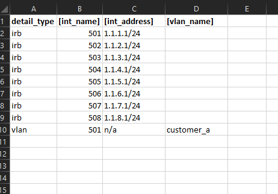

some advance usage of configs_generator
============================================

Advance Template Variables
----------------------------

Apart from usual variable/value swap and two types of code blocks explained earliar, we could have separate type of code block such as child block depends on parent block selection. Such block is to be treated slight differently.

See below example config template::

	# -------------------------------------------------
	#  repeat below block for all available vrf's
	# -------------------------------------------------
	routing-instance [vrf_name] {
	    # ---------------------------------------------
	    #  Repeat below for all interface for given vrf
	    # ---------------------------------------------
	    interface [int_name] ;
	    #
	}
	#

Here ``[int_name]`` variable selection depends on parent ``[vrf_name]`` selection. so normal **REPEAT_FOR <condition>** block will not work here b/c it requires a static value in it's condition.

**Here is solution to that:**

use ``nested_section_var_identifier`` in order to select parent variable and child variable comparision.

So for our above example Template requires to be edited as below with conditions.
where ``[int_vrf]`` is another column which should contain the vrf name for the particular interface.

Modified Template will look like::

	REPEAT EACH ([vrf_name] != "")
	routing-instance [vrf_name] {
		REPEAT EACH ([int_vrf] == PARENT.[vrf_name])
		interface [int_name] ;
		REPEAT STOP
		#
	}
	REPEAT STOP
	#

our database looks like this on *tables* tab.

.. image :: img/sample_data.png

.. code-block:: python

	# Execution will show these
	Template Verified
	configuration generation is in progress, please wait...
	Input Read.. OK
	ConfGen.. OK
	Write Config to File.. output.txt OK
	[Finished in 1.1s]

Here is what output generated there after::

	routing-instance cust_a {
		interface Gig0/2 ;
		interface Gig0/6 ;
		interface vlan501 ;
		#
	}
	routing-instance cust_b {
		interface Gig0/3 ;
		interface Gig0/7 ;
		interface vlan502 ;
		#
	}
	routing-instance cust_c {
		interface Gig0/4 ;
		interface Gig0/5 ;
		#
	}
	#

Advance condition Matching
-----------------------------

Now consider below database, from where we want to get the delta out only for odd vlan numbers.

Given Original Template::

	interfaces {
	  irb {
	    # -------------------------------------------------
	    # Repeat below segment for each odd vlan numbers
	    # -------------------------------------------------
	    unit [int_name] {
	      inet {
	        address [int_address];
	      }
	    }
	    #
	  }
	}

Template after adding conditions::

	interfaces {
	  irb {
	    REPEAT EACH ((detail_type == "irb") & ([int_name] %2== 1))
	    unit [int_name] {
	      inet {
	        address [int_address];
	      }
	    }
	    #
	    REPEAT STOP
	  }
	}

Notice the use of **%2== 1** which matches all odd numbers

Here is the output generated after execution::

	interfaces {
	  irb {
	    unit 501 {
	      inet {
	        address 1.1.1.1/24;
	      }
	    }
	    #
	    unit 503 {
	      inet {
	        address 1.1.3.1/24;
	      }
	    }
	    #
	    unit 505 {
	      inet {
	        address 1.1.5.1/24;
	      }
	    }
	    #
	    unit 507 {
	      inet {
	        address 1.1.7.1/24;
	      }
	    }
	    #
	  }
	}
